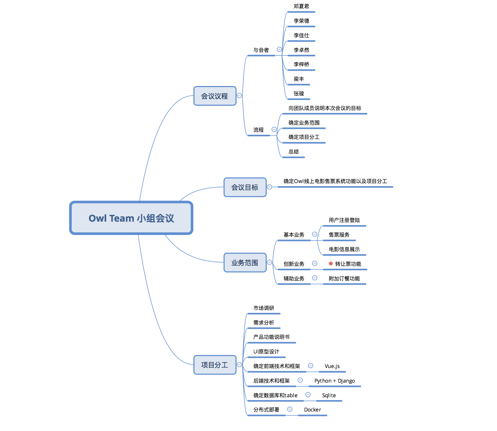

# 项目启动会议

**会议目标：** 确定Owl Movies Ticket System的功能以及项目分工

**会议时间：** 2018年3月23日

**会议人员：** 邓夏君 李荣德 张骏 李佳仕 李梓桥 李卓然 梁丰

**会议时间：** 1小时

**会议结果：**
1. 确定了Owl Movies Ticket System的主要功能
  - 在线购票功能
  - 浏览院线电影功能
  - 订餐功能
  - 转让影票功能

2. 确定了项目分工，具体可见思维导图

**会议记录思维导图**

