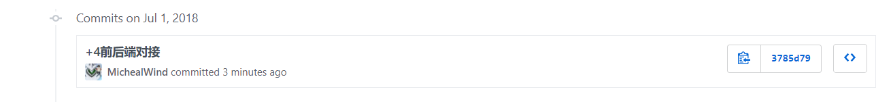
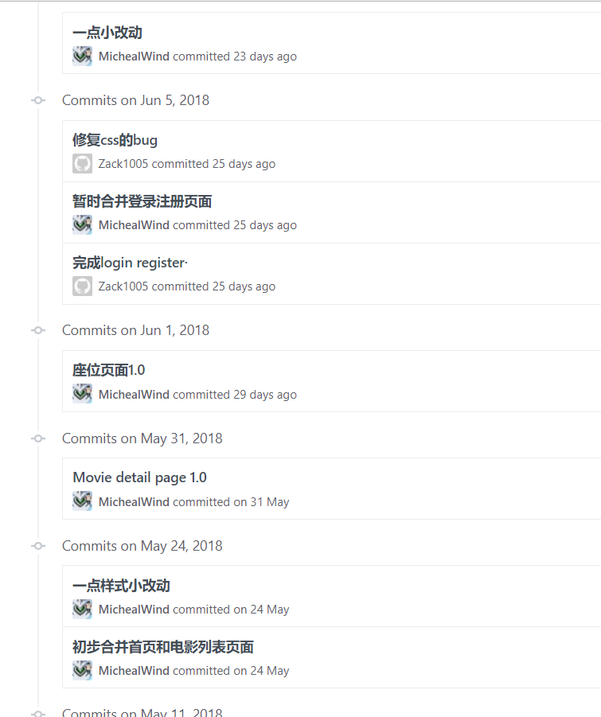
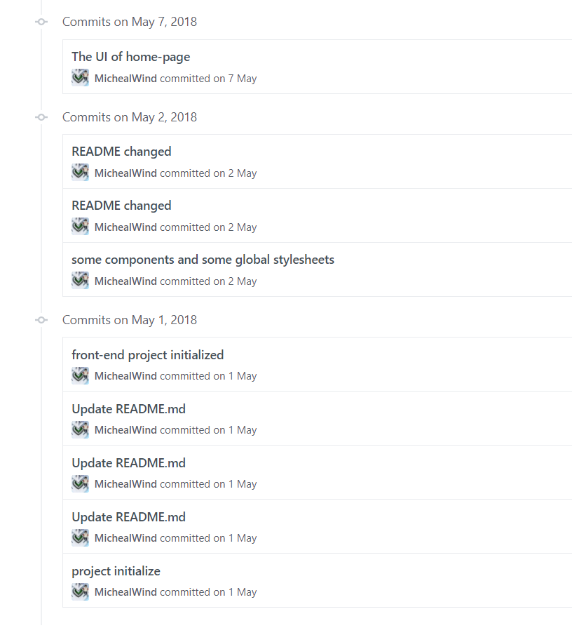
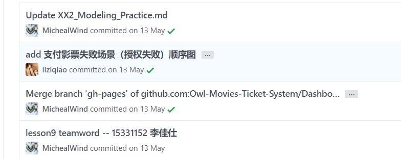

### 自我总结

### PSP 2.1 统计表

| PSP2.1 | Personal Software Process Stages | Time (%) |
| ---- | ---- | ---- |
| __Planing__ | __计划__ | __5__ |
| Estimate | 估计这个任务需要多少时间 | 5 |
| __Development__ | __开发__ | __87__ |
| Analysis | 需求分析 | 25 |
| Design Spec | 生成设计文档 | 3 |
| Design Review | 设计复审 | 2 |
| Coding Standard | 生成代码规范 | 2 |
| Design | 具体设计 | 5 |
| Coding | 具体编码 | 25 |
| Code Review | 代码复审 | 0 |
| Test | 测试 | 25 |
| __Reporting__ | __报告__ | __8__ |
| Test Report | 测试报告 | 0 |
| Size Measurement | 计算工作量 | 4 |
| Process Improvement Plan | 事后总结及改进计划 | 4 |

### Git统计报告

### 工作清单

前端整体架构搭建

前端部分页面UI实现：首页，电影详情界面，电影座位详情，电影购票界面，前端公用组件逻辑提取生成

前后端部分功能对接：首页电影列表获取，电影搜索，电影购票

### 博客清单

[JavaScript事件循环详解](https://blog.csdn.net/fenggla/article/details/79326029)

[JavaScript中_proto_与prototype的联系与区别](https://blog.csdn.net/fenggla/article/details/69491241)