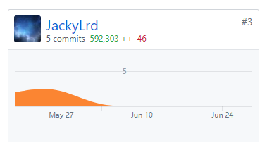
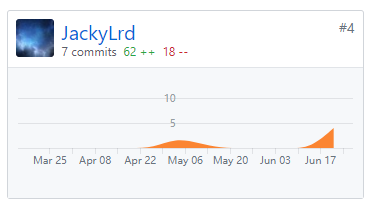

### 自我总结
系统分析与设计这门课带给我的是非常专业规范的工程体验。这门课使我学习到编写文档，建立模型，规范编程等知识，让我明白了工程是一个非常庞大，复杂，规范的系统。

### PSP 2.1 统计表
|PSP阶段|耗时(h)|
|-|-|
|计划|8|
|估计任务时间|4|
|开发|28|
|分析需求|8|
|生成设计文档|16|
|设计复审|8|
|代码规范|0|
|具体设计|8|
|具体编码|28|
|代码复审|0|
|测试|8|
|报告|8|
|测试报告|0|
|计算工作量|1|
|事后总结，提出过程改进计划|8|
|**合计**|133|

### Git统计报告

### 工作清单
项目框架搭建-Django原本是前后端不分离的架构，我成功将其前后端分离，方便开发。

### 博客清单
[Django基本命令](https://shimo.im/docs/hVYJ7mhuqjgvJzKB)
