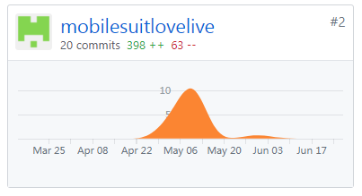
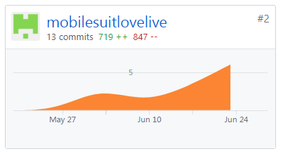

### 自我总结
这门课让我让我学到了不少除了敲代码以外的知识，非常感谢潘老师的教导。同时，大作业也让我得到了不少锻炼。感谢组里的各位同学的帮助，让我学到了不少东西。

### PSP 2.1 统计表

| PSP2.1 | Personal Software Process Stages | Time (%) |
| ---- | ---- | ---- |
| __Planing__ | __计划__ | __10__ |
| Estimate | 估计这个任务需要多少时间 | 10 |
| __Development__ | __开发__ | __80__ |
| Analysis | 需求分析 | 25 |
| Design Spec | 生成设计文档 | 10 |
| Design Review | 设计复审 | 2 |
| Coding Standard | 生成代码规范 | 2 |
| Design | 具体设计 | 5 |
| Coding | 具体编码 | 25 |
| Code Review | 代码复审 | 0 |
| Test | 测试 | 25 |
| __Reporting__ | __报告__ | __8__ |
| Test Report | 测试报告 | 0 |
| Size Measurement | 计算工作量 | 4 |
| Process Improvement Plan | 事后总结及改进计划 | 4 |

### Git统计报告

#### 文档类commit

#### 代码类commit

### 工作清单

API文档的编写

数据库建模以及models.py的部分实现与修改

后端部分API实现：获取电影院信息，获取电影信息，获取电影场次，获取餐饮供应商信息，获取餐饮服务信息

前后端部分功能对接：首页电影列表获取，电影院搜索

### 博客清单

[Django数据库基本](https://shimo.im/docs/3uPetSpH37Mf19ae/)
