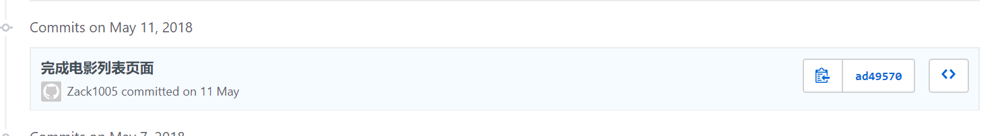
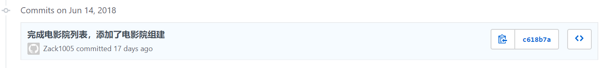
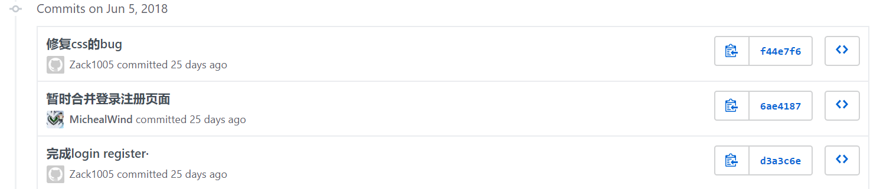
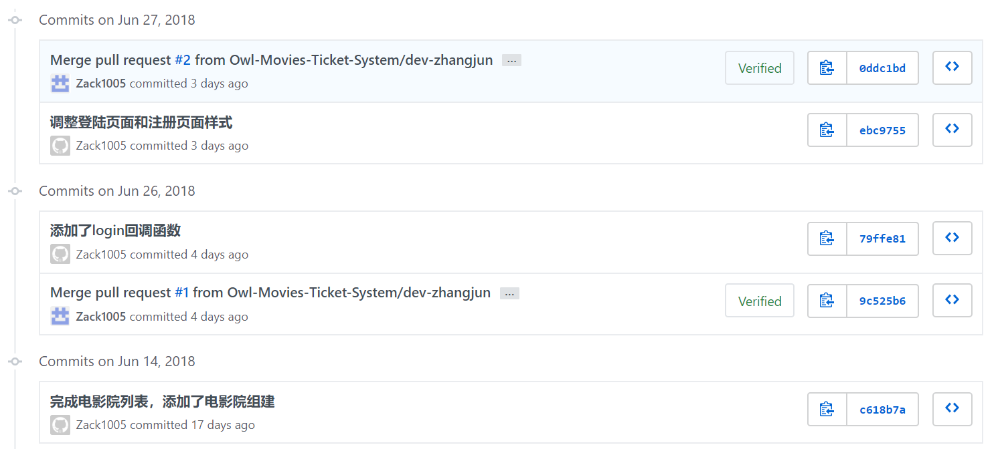

### 自我总结

这次项目学习到了很多关于前端的基础知识。包括进一步加深了前后端交互的认识。对于项目的运作周期也有了很深的认识。调试的过程中发现了很多错误，也学习了更高效的方法来找到并且解决这些问题。尤其需要感谢@MichealWind，在前端方面给予了很多指导。载整个项目学习过程中，我学习到的新知识点如下：

- vue.js技术深入
- 前端debug技术深入，学会使用network查看如何与后端对接
- 后端API的调试
- 根据文档实现具体应用逻辑

### PSP 2.1 统计表

| PSP2.1 | Personal Software Process Stages | Time (%) |
| ---- | ---- | ---- |
| __Planing__ | __计划__ | __6__ |
| Estimate | 估计这个任务需要多少时间 | 6 |
| __Development__ | __开发__ | __87__ |
| Analysis | 需求分析 | 25 |
| Design Spec | 生成设计文档 | 3 |
| Design Review | 设计复审 | 2 |
| Coding Standard | 生成代码规范 | 2 |
| Design | 具体设计 | 5 |
| Coding | 具体编码 | 25 |
| Code Review | 代码复审 | 0 |
| Test | 测试 | 25 |
| __Reporting__ | __报告__ | __8__ |
| Test Report | 测试报告 | 0 |
| Size Measurement | 计算工作量 | 4 |
| Process Improvement Plan | 事后总结及改进计划 | 4 |

### Git统计报告

### 工作清单

前端整体架构搭建

前端部分页面UI实现：登陆页面，注册页面，电影列表页面，影院列表页面

前后端部分功能对接：登陆，注册，获取电影列表，获取影院列表

后端API测试：登陆返回值，注册返回值。获取图片，获取影片信息，获取影院信息。

### 技术博客

[Vue.js](https://zack1005.github.io/2018/04/15/2018-4-13-Vue-js-Part1/)
